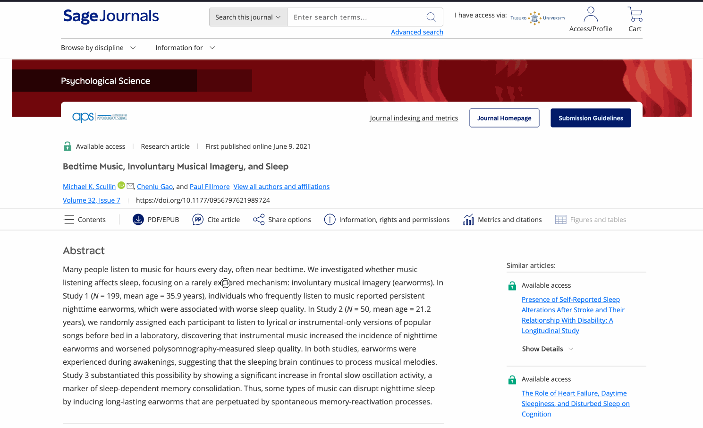

# PDF Direct

Firefox extension to skip journals' "enhanced" PDF viewers to direct PDF downloads. Currently works with 

- Sage 
- Wiley
- Taylor and Francis

## Install 

Get the add-on at <https://addons.mozilla.org/addon/pdf-direct/>

## Example

| With Extension | Without Extension |
| --- | --- |
|  |  |

`/doi/reader/10.1177/0956797621989724` → `/doi/pdf/10.1177/0956797621989724?download=true` instead of `/doi/epub/10.1177/0956797621989724`

## Suggestions

Submit an issue if you want me to add a provider / feature / squash a bug.

## License

MIT

## Development

Requirements:
- `web-ext` (`npm install -g web-ext`)
- `gh` CLI (`brew install gh`)
- `jq` (`brew install jq`)

Install for source as a temporary add-on for development and testing:

1. Download/clone <https://github.com/mvuorre/pdf-direct>
2. Open Firefox, go to `about:debugging`
3. Click "This Firefox"
4. Click "Load Temporary Add-on"
5. Select `manifest.json` from downloaded files

Build and publish extension

1. Test extension manually: `make test`
2. Lint extension: `make lint`
3. Increment version in `manifest.json`
4. Create release: `make release`
